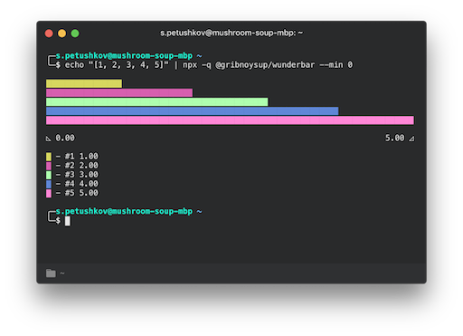
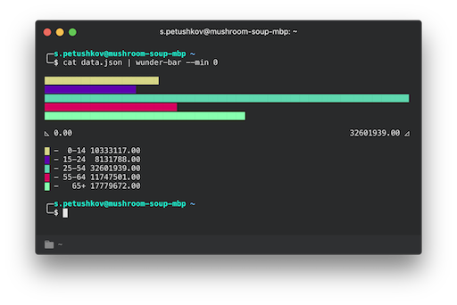
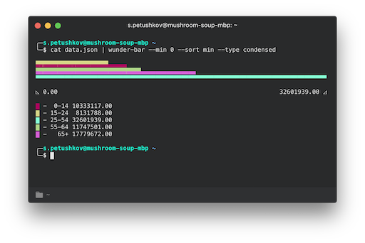
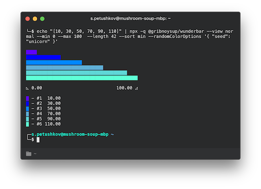

# @gribnoysup/wunderbar

Have you ever wanted to print some pretty bar charts in your terminal? You are
in the right place!

Wunderbar can print horisontal bar chart with legend and chart scale straight to
your terminal. Or you can use it as a module in your code and get all the
building blocks to print chart yourself.

## Use in terminal

```
echo "[1, 2, 3, 4, 5]" | npx @gribnoysup/wunderbar --min 0
```



```
cat data.json | npx @gribnoysup/wunderbar --min 0
```



```
cat data.json | npx @gribnoysup/wunderbar --min 0 --sort min --view condensed
```



## Use in your code

```
npm i --save @gribnoysup/wunderbar
```

```js
const wunderbar = require('@gribnoysup/wunderbar');
const data = require('./data.json');

const printData = () => {
  const { chart, legend, scale, __raw } = wunderbar(data, {
    min: 0,
    length: 42,
  });

  console.log();
  console.log(chart);
  console.log();
  console.log(scale);
  console.log();
};

printData();
```

## Limitations

* Wunderbar supports only node >= 8

* Wunderbar uses [`chalk.hex`][1] to add color to your charts. Chalk is pretty
  smart to downgrade the color if it is not supported by your terminal, but
  output may vary in different terminals.

* `"condensed"` chart view uses half box symbols to squash two chart bars to one
  line. Quality of the output is heavily dependant on your terminal font
  settings. Also min to max charts are looking much more prettier than the other
  way around in this mode ¯\\_(ツ)\_/¯. **Use with caution**

## API

### wunderbar(values, [options]) ⇒ [`OutputValue`][4]

| Param                        | Type                                                                           | Default               | Description                                   |
| ---------------------------- | ------------------------------------------------------------------------------ | --------------------- | --------------------------------------------- |
| values                       | [`Array<InputValue>`][3]                                                       |                       | Values to draw on a chart                     |
| [options]                    | `Object`                                                                       |                       | Chart drawing options                         |
| [options.view]               | `"normal" | "condensed"`                                                       | `"normal"`            | Chart view type                               |
| [options.min]                | `number`                                                                       | min value from values | Min chart value (inclusive)                   |
| [options.max]                | `number`                                                                       | max value from values | Max chart value (inclusive)                   |
| [options.length]             | `number`                                                                       | terminal width        | Chart length                                  |
| [options.sort]               | `"min" | "max" | "none" | (a: NormalizedValue, b: NormalizedValue) => boolean` | `"none"`              | Sort method for chart values                  |
| [options.randomColorOptions] | `Object`                                                                       | `{}`                  | [randomColor options][2] for color generation |

All options are also supported in the cli version:

```
echo "[10, 30, 50, 70, 90, 110]" | \
  npx @gribnoysup/wunderbar --view normal --min 0 --max 100  --length 42 --sort min --randomColorOptions '{ "seed": "unicorn" }'
```



### Types

<a name="#InputValue">**InputValue**</a> :
`{ value: number, color?: string, label?: string } | number | string`

<a name="#OutputValue">**OutputValue**</a> :
`{ legend: string, scale: string, chart: string, __raw: RawData }`

<a name="#RawData">**RawData**</a> :
`{ chartLength: number, minValue: number, maxValue: number, normalizedValues: NormalizedValue[] }`

<a name="#NormalizedValue">**NormalizedValue**</a> :
`{ normalizedValue: number, rawValue: number, color: string, label: string, lineLength: number }`

[1]: https://github.com/chalk/chalk#256-and-truecolor-color-support
[2]: https://github.com/davidmerfield/randomColor#options
[3]: #InputValue
[4]: #OutputValue
[5]: #NormalizedValue
[6]: #RawData

## License

[MIT](./LICENSE)
